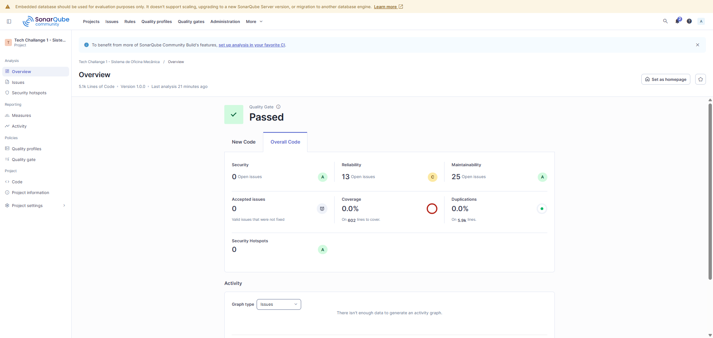
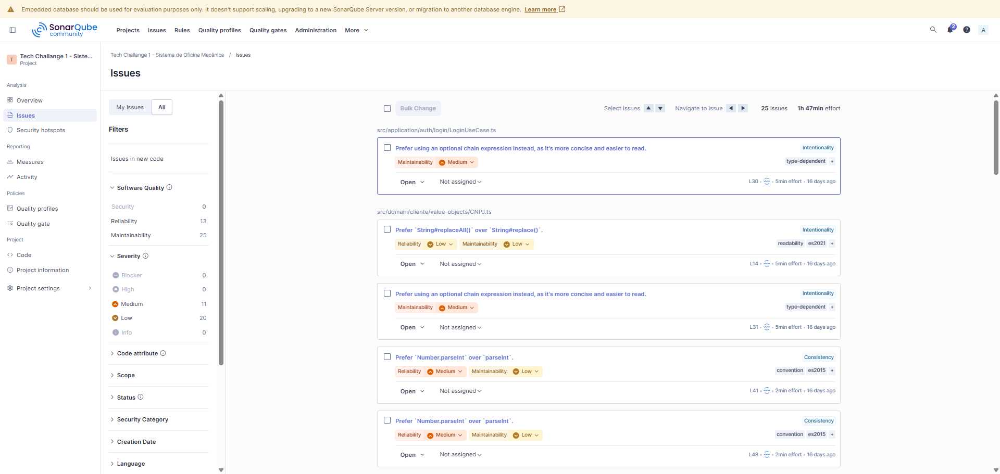

# SonarQube — Qualidade de Código

Análise estática de código realizada com SonarQube para garantir qualidade, segurança e manutenibilidade.

## Visão Geral

## Detalhes dos Issues

## Métricas Avaliadas

- **Reliability** — bugs e problemas que afetam o comportamento em produção
- **Security** — vulnerabilidades e hotspots de segurança
- **Maintainability** — code smells e dívida técnica
- **Coverage** — cobertura de testes (meta: 80% em domain e application)
- **Duplications** — duplicação de código
